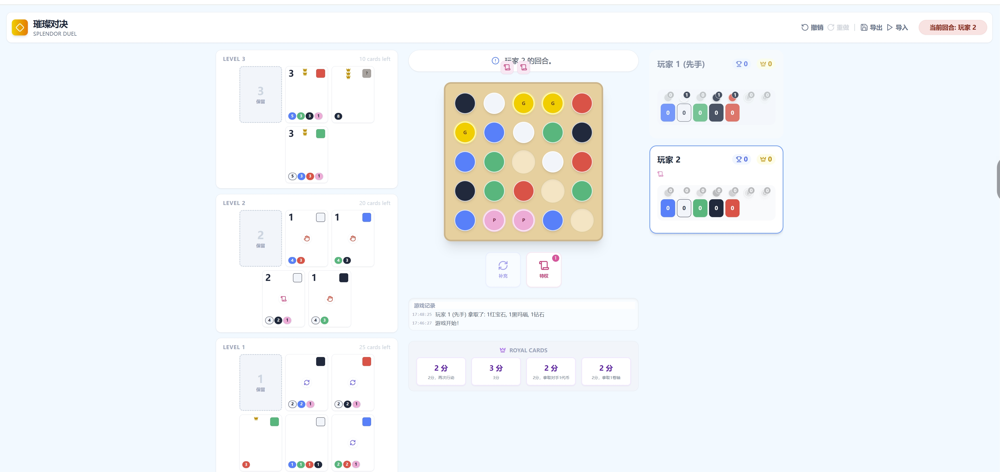

# 璀璨对决（Splendor Duel）网页版

<div align="center">
  
</div>

## 开发辅助

本项目代码由 **Gemini 3 Pro** 辅助编写。

<div align="center">
  
</div>


## 运行环境

- **Node.js**: >= 16.0.0
- **npm**: >= 8.0.0

## 快速开始

1.  **安装依赖**

    ```bash
    npm install
    ```

2.  **启动开发服务器**

    ```bash
    npm run dev
    ```
    
    启动后，浏览器访问控制台输出的地址（通常是 `http://localhost:5173`）。

3.  **构建生产版本**

    ```bash
    npm run build
    ```

4.  **预览生产版本**

    ```bash
    npm run preview
    ```

## 游戏简介
你将化身珠宝商公会的主人，为文艺复兴时期的君主及权贵打造极致华美的饰品，以此提升自身声望与财富。但你面临着一位野心勃勃的对手，是时候展现你的真正实力了！


## 游戏概述（GAME OVERVIEW）
玩家轮流进行回合，直至游戏结束触发。
你的回合中，可通过从游戏板拿取代币，或用已拥有的代币购买宝石卡，以此获取获胜所需的声望值（Prestige points）和皇冠（Crowns）。宝石卡还附带特殊能力与奖励，能降低未来购买其他宝石卡的成本。
获胜条件：达成胜利牌上标注的三个条件之一即可。

## 玩家回合（PLAYER TURN）
你的回合需遵循“先可选行动，后强制行动”的顺序：先执行0个、1个或2个可选行动（需按以下顺序执行），再必须执行1个强制行动。

### 可选行动（Optional Actions）
1. 使用特权（Use a Privilege）
   - 将1张或多张特权卷轴归还至游戏板上方的原位。每归还1张特权卷轴，可从游戏板上选择1枚宝石或珍珠代币（不可选择黄金代币）。
   - 你的所有代币需始终对对手可见，建议按颜色分堆摆放。

2. 补充游戏板（Replenish the Game Board）
   - 仅当袋子内有代币时可执行此行动。将袋子中的代币混合均匀，从游戏板中心位置开始，按印刷螺旋轨迹，将代币摆放在空着的格子上，直至袋子空无一物。
   - 执行此行动后，你的对手获得1张特权卷轴。

重要规则：游戏过程中，当你需要获取特权卷轴但游戏板上方已无剩余时，需从对手处夺取1张；若你已拥有全部3张特权卷轴，则无需执行任何操作。

### 强制行动（Mandatory Action）
必须从以下三个行动中选择一个执行：

#### 行动1：拿最多3枚代币（Take up to 3 tokens）
- 从游戏板上拿取最多3枚相邻的宝石或珍珠代币（不可拿黄金代币）。代币需呈不间断的水平、垂直或对角线排列，你也可选择只拿1枚或2枚。
- 示例：可拿取所有绿色高亮标注的代币组；不可拿取红色高亮标注的代币组——垂直组被黄金代币中断，水平组被空格中断。
- 特殊情况：若通过此行动拿取3枚同色代币，或2枚珍珠代币，你的对手获得1张特权卷轴。

#### 行动2：拿1枚黄金代币并保留1张宝石卡（Take 1 Gold token and reserve 1 Jewel card）
- 不可执行的情况：游戏板上无黄金代币，或你已保留3张宝石卡（ reserved cards）。
- 执行步骤：
  1. 从游戏板上选择1枚黄金代币拿走。
  2. 必须二选一：从金字塔中选择1张宝石卡；或从任意一个等级的宝石卡牌堆顶部抽取1张卡。
- 规则说明：保留卡数量上限为3张，需面向下放在你面前（或握在手中），对对手保密，你可随时查看自己的保留卡。
- 黄金代币仅能通过此行动获取。保留卡与金字塔中的卡牌一样，未购买前不生效，游戏结束时持有保留卡无惩罚。
- 若从金字塔中保留卡牌，需从对应等级的牌堆中抽取1张新卡，面朝上放入金字塔补充空位；若对应牌堆已空，则无需补充。

#### 行动3：购买1张宝石卡（Purchase 1 Jewel card）
- 选择范围：金字塔中的卡牌或你的保留卡。
- 支付规则：按卡牌左下角标注的成本支付代币（黄金代币为万能代币，可替代任意宝石或珍珠代币），支付后的代币需放回袋子中。
- 卡牌摆放：将购买的卡牌面朝上放在你面前，按奖励颜色分类摆放（可重叠以节省空间，但卡牌顶部的声望值、皇冠及奖励信息必须可见）。
- 奖励效果：购买后立即获得卡牌右上角标注的奖励，每种奖励可降低未来购买宝石卡的对应成本（例如：某张卡牌奖励为“绿色-1”，则未来购买所有卡牌时，绿色代币成本均减少1枚）。部分卡牌含2个奖励，可降低2枚对应成本。
- 特殊说明：奖励可将卡牌成本降至0枚代币，但不可低于0（即购买卡牌时无法获得额外代币）；珍珠无对应奖励效果。
- 补充规则：从金字塔中购买卡牌后，需从对应等级的牌堆中抽取1张新卡，面朝上放入金字塔补充空位。

### 特殊情况处理
若你无法执行任何一个强制行动，需先执行“补充游戏板”的可选行动（若满足执行条件），之后再选择强制行动。

## 卡牌能力（CARD ABILITIES）
购买卡牌后，若该卡牌带有能力（标识在卡牌上），需立即触发效果：
- 🔄：本回合结束后，立即额外获得一个回合。
- 🎨：将此卡重叠在一张带有奖励的宝石卡上（见右侧示例），此卡的奖励颜色视为被重叠卡牌的奖励颜色。若你无带有奖励的宝石卡，则不可购买此卡。
- 🟢/🔵/⚪/⚫/🔴（对应宝石色）：从游戏板上拿取1枚与该卡牌颜色一致的代币；若该颜色代币已无剩余，则效果无效。
- 📜：获得1张特权卷轴；若无剩余，则从对手处夺取1张。
- 🔄（对手代币）：从对手处拿取1枚宝石或珍珠代币（不可拿黄金代币）；若对手无此类代币，则效果无效。

## 皇冠机制（CROWNS）
部分宝石卡顶部会标注1个或多个皇冠（Crowns），触发以下规则：
- 当你获得第3个皇冠时，从可用的皇家卡中选择1张，立即触发其能力。
- 当你获得第6个皇冠时，再从剩余的皇家卡中选择1张，立即触发其能力。
- 拿取皇家卡不算作行动，需将皇家卡放在你的宝石卡旁边。

示例：朱莉购买了一张白色卡牌，获得了第3个皇冠，因此可选择1张可用的皇家卡，该卡为她带来1张特权卷轴和2点声望值。

## 回合结束（END OF PLAYER TURN）
1. 完成强制行动后，统计你拥有的所有代币（宝石、珍珠、黄金），若总数超过10枚，需弃置多余代币（自主选择弃置哪些），弃置的代币放回袋子。
2. 检查是否达成任意一个胜利条件，若达成则立即获胜；若未达成，轮到对手进行回合。

## 胜利条件（VICTORY CONDITIONS）
回合结束时，若你达成以下任意一个或多个条件，游戏立即结束，你获胜：
1. 声望值达到20点或以上。
2. 皇冠数量达到10个或以上。
3. 同一种颜色的宝石卡上，累计声望值达到10点或以上（重叠的卡牌视为其所在组的颜色，见右侧示例）。

## 规则提醒（REMINDERS）
1. 随机选择先手玩家，后手玩家获得1张特权卷轴。
2. 需获取特权卷轴但无剩余时，从对手处夺取1张。
3. 黄金代币为万能代币，可替代任意宝石或珍珠代币。
4. “拿1枚黄金代币并保留1张宝石卡”是获取黄金代币的唯一方式。
5. 游戏板上无黄金代币或已保留3张卡时，不可执行“拿1枚黄金代币并保留1张宝石卡”行动。
6. 游戏结束时持有保留卡无惩罚。
7. 无带有奖励的宝石卡时，不可购买需重叠触发奖励的卡牌。
8. 回合进行中，代币数量可超过10枚，但回合结束时必须弃置至10枚。
9. 达成任意胜利条件后，游戏立即结束，你获胜！


## 玩家辅助卡（PLAYER AID）
1. 可选行动：
   - 消耗1张特权卷轴：获取1枚非黄金代币。
   - 补充游戏板空位：对手获得1张特权卷轴。
2. 强制行动（三选一）：
   - 拿最多3枚相邻的非黄金代币（水平/垂直/对角线连续），若拿3枚同色或2枚珍珠，对手得1张特权卷轴。
   - 拿1枚黄金代币+保留1张卡（不可执行：无黄金代币或已保留3张卡）。
   - 购买卡牌（金字塔/保留卡）：支付成本（扣除已获奖励）。
3. 获得新卡后，触发其能力（若有）：
   - 额外获得一个回合。
   - 拿1枚与卡牌同色的代币。
   - 复制已获奖励的颜色。
   - 获得1张特权卷轴。
   - 从对手处拿1枚非黄金代币。
4. 获得第3个或第6个皇冠：拿1张皇家卡。
5. 回合间代币上限为10枚。
6. 游戏结束与胜利：
   - 20点声望值 或
   - 10个皇冠 或
   - 同色卡牌累计10点声望值。
